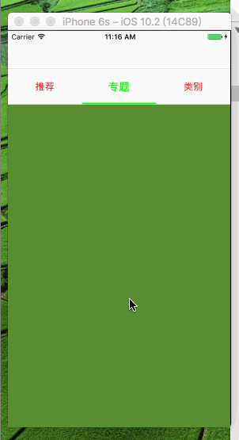
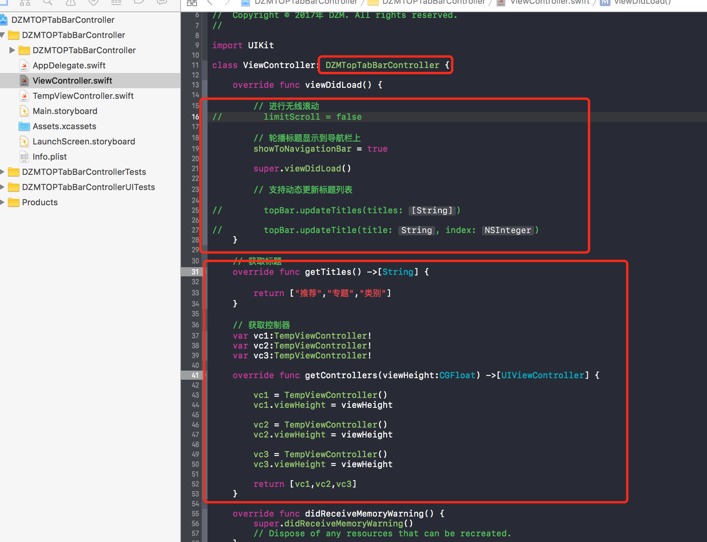

# DZMTOPTabBarController
头部TopTabBar 支持导航栏 导航栏下面（一行BOOL值搞定）支持无线滚动以及不无限滚动（一行BOOL值搞定）

标题列表 文字 字体 字号 颜色 间距 滑条颜色 等等都是支持中途动态修改的 

# 使用代码

##期待
* 如果在使用过程中遇到BUG，希望你能Issues我，谢谢!
* 如果在使用过程中发现功能不够用，希望你能Issues我.
